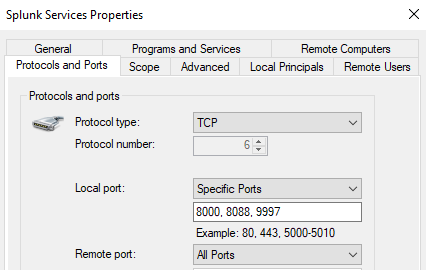

# Windows Firewall Rules for Splunk

## Overview

Windows Firewall will block Splunk's ports by default. Before Splunk is installed, these rules should be in place so that:

- The **Splunk Web UI** (port 8000) is accessible from your host and Kali machine
- The **Universal Forwarder** can ship logs to the indexer (port 9997)
- The **HTTP Event Collector** can receive data (port 8088)
- The **Splunk management port** is accessible (port 8089)
- **ICMP (ping)** works from other machines for connectivity testing

All commands below are run in **PowerShell as Administrator** on the Windows 10 VM.

---

## Splunk Port Reference

| Port   | Protocol | Purpose                           |
| ------ | -------- | --------------------------------- |
| `8000` | TCP      | Splunk Web UI (browser access)    |
| `9997` | TCP      | Forwarder → Indexer log ingestion |
| `8088` | TCP      | HTTP Event Collector (HEC)        |
| `514`  | UDP      | Syslog input (optional)           |

---

## PowerShell Commands (Recommended)

Open **PowerShell as Administrator** and run each block:

### Allow ICMP (Ping) - Do This First

```powershell
# Allow inbound ping so other VMs can reach Windows 10
netsh advfirewall firewall add rule `
  name="Allow ICMPv4 Inbound" `
  protocol=icmpv4:8,any `
  dir=in `
  action=allow
```

### Splunk Web UI - Port 8000

```powershell
New-NetFirewallRule `
  -DisplayName "Splunk Web UI" `
  -Direction Inbound `
  -Protocol TCP `
  -LocalPort 8000 `
  -Action Allow `
  -Profile Any `
  -Description "Splunk Web interface on port 8000"
```

### Splunk Forwarder Receiver - Port 9997

```powershell
New-NetFirewallRule `
  -DisplayName "Splunk Forwarder Receiver" `
  -Direction Inbound `
  -Protocol TCP `
  -LocalPort 9997 `
  -Action Allow `
  -Profile Any `
  -Description "Log data from Splunk Universal Forwarder"
```

### Splunk HTTP Event Collector - Port 8088

```powershell
New-NetFirewallRule `
  -DisplayName "Splunk HTTP Event Collector" `
  -Direction Inbound `
  -Protocol TCP `
  -LocalPort 8088 `
  -Action Allow `
  -Profile Any `
  -Description "Splunk HEC for HTTP-based log ingestion"
```

### Optional: Syslog - Port 514 UDP

```powershell
# Only needed if you plan to ingest syslog from other devices
New-NetFirewallRule `
  -DisplayName "Splunk Syslog UDP" `
  -Direction Inbound `
  -Protocol UDP `
  -LocalPort 514 `
  -Action Allow `
  -Profile Any `
  -Description "UDP Syslog input for Splunk"
```

---

### From Kali Linux - Test Ports are Reachable

```bash
# After Splunk is installed on Windows 10, test from Kali
# Replace 192.168.0.123 with your Windows 10 IP

# Test Web UI port
nc -zv 192.168.0.123 8000

# Test forwarder port
nc -zv 192.168.0.123 9997

# Quick scan of all Splunk ports
nmap -p 8000,8088,9997 192.168.0.123
```

---

## Screenshots



---

## Notes

- You can also set firewall rules via wf.msc instead of powershell
- Rules set with `-Profile Any` apply to Domain, Private, and Public network profiles. Since this is a lab environment this is fine.
- If you ever disable Windows Firewall entirely for testing, re-enable it afterward: `Set-NetFirewallProfile -Profile Domain,Public,Private -Enabled True`
- Splunk also has its own internal access controls - firewall rules only control what traffic reaches the machine, not what Splunk itself permits.
