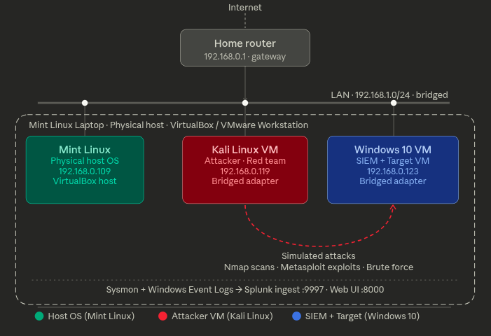

# Network Topology

## Lab IP Address Table

| Machine         | OS         | Role            | IP Address      | Subnet Mask     | Gateway       |
| --------------- | ---------- | --------------- | --------------- | --------------- | ------------- |
| Linux Mint Host | Linux Mint | Hypervisor      | `192.168.0.109` | `255.255.255.0` | `192.168.0.1` |
| Kali Linux VM   | Kali Linux | Attacker        | `192.168.0.119` | `255.255.255.0` | `192.168.0.1` |
| Windows 10 VM   | Windows 10 | Victim + Splunk | `192.168.0.123` | `255.255.255.0` | `192.168.0.1` |
| Home Router     | -          | Default Gateway | `192.168.0.1`   | -               | -             |

---

## Network Diagram




---

## Port Map — Windows 10 VM (Splunk Server)

| Port   | Protocol | Service               | Direction | Source           |
| ------ | -------- | --------------------- | --------- | ---------------- |
| `8000` | TCP      | Splunk Web UI         | Inbound   | All lab machines |
| `9997` | TCP      | Forwarder Receiver    | Inbound   | Splunk Forwarder |
| `8088` | TCP      | HTTP Event Collector  | Inbound   | Any log source   |
| `8089` | TCP      | Splunk Management API | Inbound   | Local / Admin    |
| `3389` | TCP      | RDP (optional)        | Inbound   | Host only        |

---

## VirtualBox Adapter Settings

Both VMs must have this configuration in VirtualBox:

```
VM Settings → Network → Adapter 1:
  ✅ Enable Network Adapter
  Attached to: Bridged Adapter
  Name: [Your host machine's active NIC]
        (e.g., eth0, wlan0, enp3s0)
  Promiscuous Mode: Deny (default is fine)
```

> **Why Bridged?** Bridged mode gives each VM its own IP on your real home network, just like a physical machine plugged into your router. This allows direct IP-to-IP communication between all machines without NAT or port forwarding complexity.

---

## Connectivity Matrix

After setup, all of the following ping tests should succeed:

| From            | To                 | Expected Result |
| --------------- | ------------------ | --------------- |
| Linux Mint Host | Kali VM            | ✅ Success       |
| Linux Mint Host | Windows 10 VM      | ✅ Success       |
| Kali VM         | Linux Mint Host    | ✅ Success       |
| Kali VM         | Windows 10 VM      | ✅ Success       |
| Windows 10 VM   | Linux Mint Host    | ✅ Success       |
| Windows 10 VM   | Kali VM            | ✅ Success       |
| Any Machine     | 8.8.8.8 (Internet) | ✅ Success       |

---

## Quick Reference Commands

### Get IP Addresses

```bash
# Linux Mint Host / Kali Linux
ip a
hostname -I

# Windows 10 (PowerShell)
ipconfig /all
Get-NetIPAddress | Where-Object { $_.AddressFamily -eq "IPv4" }
```

### Verify Routing Table

```bash
# Linux / Kali
ip route

# Windows 10
route print
```

### DNS Test

```bash
# Linux / Kali
nslookup google.com
dig google.com

# Windows 10
nslookup google.com
Resolve-DnsName google.com
```

---

- [ ] `ip a` output on Kali showing the static IP
- [ ] `ipconfig /all` output on Windows 10 showing static IP
- [ ] Successful ping from Kali to Windows 10
- [ ] Successful ping from Windows 10 to Kali
- [ ] VirtualBox network adapter settings screenshot for each VM
