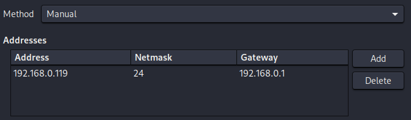
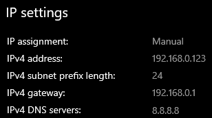

# Static IP Configuration

## Why Static IPs?

By default, VMs receive dynamic IPs via DHCP. If a VM reboots, its IP can change - breaking your Splunk forwarder configuration and any saved attack targets. Setting static IPs ensures everything stays consistent across reboots.

---

## Step 1 - Find Your Network Details (Run on Linux Mint Host)

Before setting anything, identify your subnet, gateway, and DNS:

```bash
# View your host's network interfaces and current IP
ip a

# Find your default gateway (router IP)
ip route | grep default

# Find your DNS server
cat /etc/resolv.conf
```

**Example output to look for:**

```
# From 'ip a' — your host might look like:
 inet 192.168.0.109/24 brd 192.168.0.255 scope global dynamic

# From 'ip route':
default via 192.168.0.1 dev eth0

# From resolv.conf:
nameserver 192.168.0.1
```

> Write down your gateway IP and subnet. You'll need them for both VMs.
> Choose two unused IPs on the same subnet for your VMs (e.g., .119 and .123).

---

## Step 2 - Set Static IP on Kali Linux

### Method A: Using `nmcli` (Recommended - persistent across reboots)

```bash
# List available connections to find your interface name
nmcli connection show

# Identify the active connection name (usually 'Wired connection 1' or similar)
nmcli device status
```

```bash
# Set a static IP - replace values with your own
# CONNECTION_NAME = output from above (e.g., "Wired connection 1")
# Replace 192.168.0.XX with your chosen Kali IP
# Replace 192.168.0.1 with your actual gateway

nmcli connection modify "Wired connection 1" \
  ipv4.method manual \
  ipv4.addresses 192.168.0.119/24 \
  ipv4.gateway 192.168.0.1 \
  ipv4.dns "192.168.0.1,8.8.8.8"
```

```bash
# Bring the connection down and back up to apply changes
nmcli connection down "Wired connection 1"
nmcli connection up "Wired connection 1"
```

```bash
# Verify the new static IP is applied
ip a show eth0
# or
nmcli connection show "Wired connection 1" | grep ipv4
```



---

## Step 3 - Set Static IP on Windows 10

### Method A: GUI (Control Panel)

1. Open **Settings** → **Network & Internet** → **Change adapter options**
2. Right-click your active adapter → **Properties**
3. Select **Internet Protocol Version 4 (TCP/IPv4)** → **Properties**
4. Select **Use the following IP address** and fill in:
   - IP address: `192.168.0.123` *(your chosen Windows IP)*
   - Subnet mask: `255.255.255.0`
   - Default gateway: `192.168.0.1` *(your router)*
5. Select **Use the following DNS server addresses**:
   - Preferred DNS: `8.8.8.8`
   - Alternate DNS: `1.1.1.1`
6. Click OK → Close
   
   
   
   

---

## Step 4 - Verify Connectivity (Ping Tests)

Run these tests to confirm all machines can talk to each other.

### From Linux Mint Host:

```bash
# Ping Kali VM
ping 192.168.0.119

# Ping Windows 10 VM
ping 192.168.0.123
```

### From Kali Linux:

```bash
# Ping Host
ping 192.168.0.109    # replace with your host IP

# Ping Windows 10 VM
ping 192.168.0.123

# Test internet connectivity
ping 8.8.8.8
```

### From Windows 10 (CMD):

```powershell
# Ping Host
ping 192.168.0.109

# Ping Kali VM
ping 192.168.0.119

# Test internet connectivity
ping 8.8.8.8
```

> ⚠️ **Windows 10 ICMP Note:** Windows Firewall blocks ping by default.
> If pings to Windows 10 fail, enable ICMP in the firewall:

```powershell
# Run in PowerShell as Administrator
netsh advfirewall firewall add rule `
  name="Allow ICMPv4 Inbound" `
  protocol=icmpv4:8,any `
  dir=in `
  action=allow
```

---

## Step 5 - Record Your Final IP Addresses

Once everything is working, update the table in [network-topology.md](./network-topology.md) with your actual IPs.

| Machine         | Role            | IP Address      |
| --------------- | --------------- | --------------- |
| Linux Mint Host | Hypervisor      | `192.168.0.109` |
| Kali Linux VM   | Attacker        | `192.168.0.119` |
| Windows 10 VM   | Victim + Splunk | `192.168.0.123` |

---

## Troubleshooting

| Problem                    | Fix                                                             |
| -------------------------- | --------------------------------------------------------------- |
| VM gets no IP at all       | Check VirtualBox Bridged Adapter is set to the correct host NIC |
| Ping to Windows 10 fails   | See ICMP firewall rule above                                    |
| Kali loses IP after reboot | Confirm you used `nmcli` method, not just `ip addr add`         |
| Wrong subnet               | Re-run `ip a` on your host and match the subnet exactly         |
| DNS not resolving          | Temporarily use `8.8.8.8` as your only DNS to test              |
